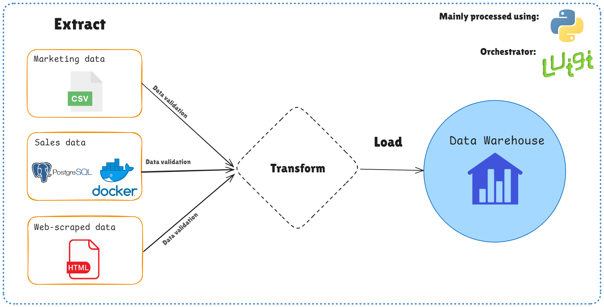
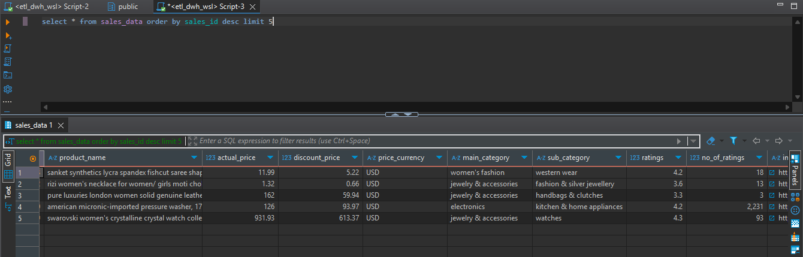
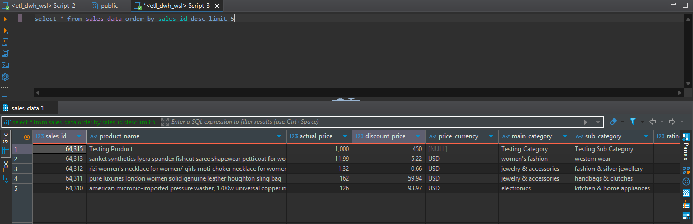

# ETL Pipeline Project

## Table of Contents

1. [Overview](#overview)
2. [Data Sources](#data-sources)
   - [Sales Data](#sales-data)
   - [Marketing Data](#marketing-data)
   - [Web-Scraped Data](#web-scraped-data)
3. [Challenges and Solutions](#challenges-and-solutions)
   - [Sales Data Issues](#sales-data-issues)
   - [Marketing Data Issues](#marketing-data-issues)
   - [Web Scraping Challenges](#web-scraping-challenges)
4. [Proposed Solution](#proposed-solution)
   - [Data Extraction](#data-extraction)
   - [Data Transformation](#data-transformation)
   - [Data Loading](#data-loading)
5. [Tools and Technology](#tools-and-technology)
6. [Pipeline Workflow](#pipeline-workflow)
7. [Testing Scenario](#testing-scenario)

---

## Overview

This project builds an **ETL (Extract, Transform, Load)** pipeline for processing and integrating data from multiple sources, including a CSV files, PostgreSQL database, and web-scraped articles, into a structured data warehouse.

---

## Data Sources

### Marketing Data

- Source: CSV file (`ElectronicsProductsPricingData.csv`).
- Details: Contains electronics product pricing and availability.

### Sales Data

- Source: Dockerized PostgreSQL database.
- Details: Includes product details, categories, prices, and ratings.

### Web-Scraped Data

- Source: CNN Indonesia
- Details: Extracted data includes article titles, publication dates, and other relevant information.

**DISCLAIMER**
ALL OF SCRAPED DATA IN THIS PROJECT IS ONLY FOR LEARNING PURPOSE ONLY.
MAKE SURE TO CHECK THE TERM & CONDITIONS OF A WEBSITE BEFORE DO A WEB SCRAPING.

---

## Challenges and Solutions

### Sales Data Issues

- **Problems**: Inconsistent formats (e.g., price symbols), missing values, and duplicate records.
- **Solutions**: Apply data cleaning, implement validation checks, and set up an automated ETL pipeline.

### Marketing Data Issues

- **Problems**: Irrelevant columns, inconsistent data formats, and duplicates.
- **Solutions**: Normalize and clean the data, remove duplicates, and integrate with other data sources.

### Web Scraping Challenges

- **Problems**: Regular updates to website structures and incomplete scraped data.
- **Solutions**: Maintain and test scraping scripts, validate data quality, and implement scheduling for periodic scraping.

---

## Proposed Solution

### Data Extraction

- Fetch data from PostgreSQL, CSV files, and scraped HTML data using tools like BeautifulSoup.

### Data Transformation

- Clean and normalize all data to meet stakeholder requirements (e.g., removing duplicates, handling missing values, and converting formats).

### Data Loading

- Use PostgreSQL for structured storage and `pangres` for upserts to manage updates.

---

## Tools and Technology

- **Languages**: Python (with libraries like pandas, BeautifulSoup, and SQLAlchemy).
- **Database**: PostgreSQL (Dockerized), DBeaver.
- **Orchestration**: Luigi for task management and workflow.
- **Automation**: Cron for scheduling tasks.

---

## Pipeline Workflow

1. **Extract**: Gather data from databases, files, and web sources.
2. **Validate**: Ensure data integrity and correct formatting.
3. **Transform**: Clean, normalize, and enrich data.
4. **Load**: Store processed data in a PostgreSQL warehouse.

---

## Testing Scenario

Try to add this data into **sales_data** table:
`INSERT INTO amazon_sales_data ("name",main_category,sub_category,image,link,ratings,no_of_ratings,discount_price,actual_price)
values ('Testing Product', 'Testing Category', 'Testing Sub Category', 'https://sekolahdata-assets.s3.ap-southeast-1.amazonaws.com/notebook-images/mde-intro-to-data-eng/testing_image.png', 'https://pacmann.io/', 5, 30, 450, 1000)`

- **Before:**
  

- **After:**
  
